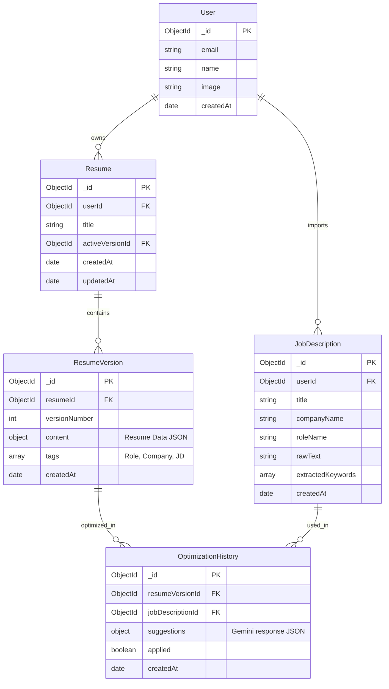
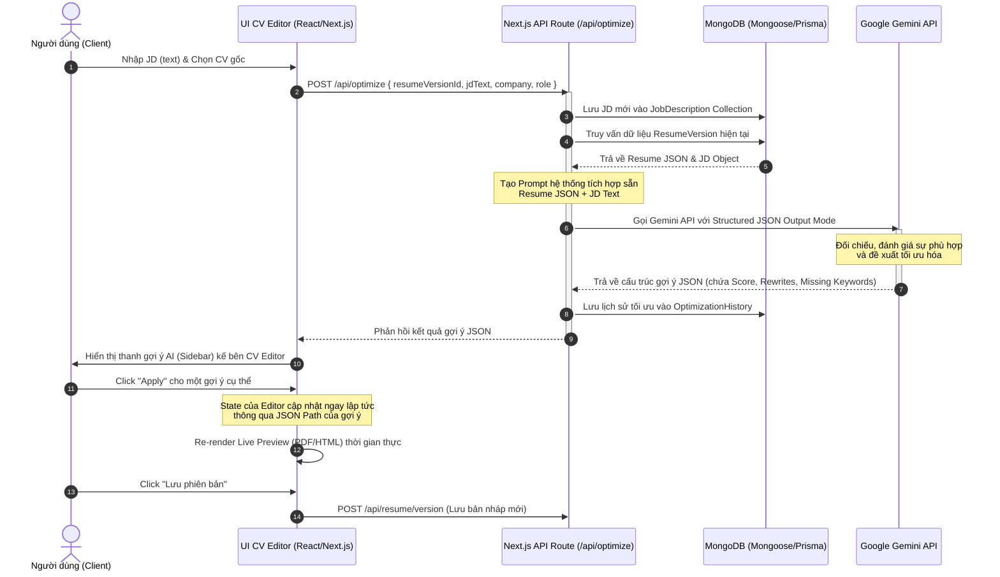

# FitCV.ai - Tài liệu Thiết kế Kiến trúc Hệ thống & Tối ưu hóa CV bằng AI

Tài liệu này trình bày chi tiết kiến trúc dữ liệu, luồng vận hành hệ thống (workflows), cấu trúc prompt tối ưu với Gemini API và giải pháp triển khai giao diện chỉnh sửa CV trực quan (Real-time Editor) cho dự án **FitCV.ai**.

---

## 1. Kiến trúc dữ liệu (Database Schema)

Để xây dựng một trình chỉnh sửa CV linh hoạt như FlowCV, chúng ta nên lưu trữ dữ liệu CV dưới dạng **cấu trúc JSON lồng nhau (Nested JSON)** thay vì text thuần. Điều này giúp dễ dàng ánh xạ dữ liệu lên các trường biểu mẫu (Form Inputs) và cho phép AI chỉ ra chính xác vị trí cần chỉnh sửa (thông qua đường dẫn JSON path).

Dưới đây là sơ đồ thực thể liên kết (ER Diagram) mô tả các collections trong MongoDB:



### Chi tiết các Collections (Mongoose Schemas)

#### A. User Collection
Lưu trữ thông tin cơ bản của người dùng (tích hợp với Auth.js / NextAuth).
```typescript
const UserSchema = new Schema({
  email: { type: String, required: true, unique: true },
  name: { type: String },
  image: { type: String },
  createdAt: { type: Date, default: Date.now },
});
```

#### B. Resume Collection
Quản lý siêu dữ liệu (metadata) của một CV. Một CV có thể có nhiều phiên bản.
```typescript
const ResumeSchema = new Schema({
  userId: { type: Schema.Types.ObjectId, ref: 'User', required: true },
  title: { type: String, required: true, default: 'Untitled CV' },
  activeVersionId: { type: Schema.Types.ObjectId, ref: 'ResumeVersion' },
  createdAt: { type: Date, default: Date.now },
  updatedAt: { type: Date, default: Date.now },
});
```

#### C. ResumeVersion Collection (Quan trọng)
Lưu trữ cấu trúc dữ liệu JSON chi tiết của CV ở một thời điểm cụ thể.
```typescript
const ResumeVersionSchema = new Schema({
  resumeId: { type: Schema.Types.ObjectId, ref: 'Resume', required: true },
  versionNumber: { type: Number, required: true },
  tags: {
    role: { type: String },      // Vị trí (e.g. Frontend Engineer)
    company: { type: String },   // Công ty (e.g. Google)
    jdId: { type: Schema.Types.ObjectId, ref: 'JobDescription' } // Liên kết JD
  },
  // Cấu trúc Resume Data JSON
  content: {
    personalInfo: {
      fullName: { type: String },
      title: { type: String }, // e.g. Senior Frontend Developer
      email: { type: String },
      phone: { type: String },
      website: { type: String },
      github: { type: String },
      linkedin: { type: String },
      location: { type: String },
      summary: { type: String }, // Tóm tắt bản thân
    },
    workExperience: [{
      id: { type: String, required: true }, // Dùng UUID/NanoID để xác định phần tử ở FE
      company: { type: String },
      position: { type: String },
      location: { type: String },
      startDate: { type: String }, // Định dạng YYYY-MM
      endDate: { type: String },   // YYYY-MM hoặc "Present"
      current: { type: Boolean },
      description: [{ type: String }] // Danh sách gạch đầu dòng (bullet points)
    }],
    education: [{
      id: { type: String, required: true },
      school: { type: String },
      degree: { type: String },
      fieldOfStudy: { type: String },
      location: { type: String },
      startDate: { type: String },
      endDate: { type: String },
      description: { type: String }
    }],
    skills: [{
      id: { type: String, required: true },
      category: { type: String }, // e.g. Programming Languages, Frameworks
      items: [{ type: String }]    // e.g. ["JavaScript", "TypeScript"]
    }],
    projects: [{
      id: { type: String, required: true },
      name: { type: String },
      role: { type: String },
      description: { type: String },
      technologies: [{ type: String }],
      url: { type: String }
    }],
    languages: [{
      id: { type: String, required: true },
      language: { type: String },
      proficiency: { type: String } // e.g. Native, Professional
    }],
    certifications: [{
      id: { type: String, required: true },
      name: { type: String },
      issuer: { type: String },
      date: { type: String }
    }]
  },
  createdAt: { type: Date, default: Date.now }
});
```

> [!TIP]
> Sử dụng trường `id` dạng chuỗi (ví dụ: `exp-1`, `edu-1` được tạo bởi `nanoid` ở Frontend) cho các phần tử mảng thay vì dựa vào chỉ số `index`. Điều này giúp việc thêm, xóa, sắp xếp lại (drag & drop) và cập nhật dữ liệu của Frontend không bị lỗi đồng bộ và giúp AI có thể chỉ định chính xác trường cần cập nhật qua ID.

---

## 2. Luồng xử lý hệ thống (System Workflow)

Luồng hoạt động khi người dùng yêu cầu tối ưu hóa CV dựa trên một JD:



### Chi tiết các bước xử lý tại Next.js Route Handler

1. **Nhận request**: Route handler nhận request chứa `resumeVersionId` và `jobDescriptionId` (hoặc thông tin JD thô).
2. **Chuẩn bị dữ liệu**: Đọc dữ liệu CV từ Database. Tối giản các thông tin không cần thiết trước khi gửi lên AI (ví dụ: lược bỏ ảnh đại diện, số điện thoại để bảo mật và tiết kiệm token).
3. **Gọi Gemini API**:
   - Sử dụng phiên bản SDK mới nhất `@google/genai` hoặc `@google/generative-ai`.
   - Cấu hình `responseMimeType: "application/json"` và truyền kèm `responseSchema` (được định nghĩa bên dưới) để đảm bảo dữ liệu trả về chuẩn 100%.

---

## 3. Cấu trúc Prompt gửi cho Gemini API

Để AI trả về định dạng JSON có cấu trúc chính xác, chúng ta cần khai báo cả **System Prompt** và **Response Schema** cho Gemini API.

### A. Response Schema (Định nghĩa định dạng JSON mong muốn)

Định nghĩa schema này bằng thư viện `@google/genai` (Node.js SDK) để ép kiểu dữ liệu đầu ra:

```typescript
import { Type, Schema } from '@google/genai';

export const CVAnalysisSchema: Schema = {
  type: Type.OBJECT,
  properties: {
    overallScore: {
      type: Type.INTEGER,
      description: "Điểm độ phù hợp giữa CV hiện tại với JD (từ 0 đến 100)."
    },
    analysisSummary: {
      type: Type.STRING,
      description: "Đánh giá tóm tắt về điểm mạnh và các điểm còn thiếu sót của CV so với JD."
    },
    missingKeywords: {
      type: Type.ARRAY,
      items: { type: Type.STRING },
      description: "Danh sách các từ khóa kỹ thuật hoặc kỹ năng quan trọng trong JD nhưng chưa xuất hiện hoặc chưa rõ ràng trong CV."
    },
    suggestedAdditions: {
      type: Type.ARRAY,
      items: {
        type: Type.OBJECT,
        properties: {
          section: { 
            type: Type.STRING, 
            description: "Phần cần thêm vào trong CV (ví dụ: 'skills', 'projects', 'certifications')." 
          },
          content: { 
            type: Type.STRING, 
            description: "Nội dung đề xuất viết thêm vào." 
          },
          reasoning: { 
            type: Type.STRING, 
            description: "Giải thích tại sao việc thêm nội dung này giúp CV phù hợp hơn với JD." 
          }
        },
        required: ["section", "content", "reasoning"]
      },
      description: "Đề xuất thêm mới những mục quan trọng bị thiếu mà ứng viên có thể có."
    },
    suggestedRewrites: {
      type: Type.ARRAY,
      items: {
        type: Type.OBJECT,
        properties: {
          path: { 
            type: Type.STRING, 
            description: "Đường dẫn JSON trỏ đến đúng trường dữ liệu cần sửa. Ví dụ: 'workExperience.0.description.1' đại diện cho bullet point thứ 2 trong công việc đầu tiên, hoặc 'personalInfo.summary'." 
          },
          itemId: {
            type: Type.STRING,
            description: "ID của phần tử mảng cần chỉnh sửa (ví dụ: ID của workExperience như 'exp-1'). Nhằm đảm bảo ánh xạ chính xác trên frontend kể cả khi vị trí mảng thay đổi."
          },
          originalText: { 
            type: Type.STRING, 
            description: "Nội dung văn bản gốc cần được thay thế." 
          },
          suggestedText: { 
            type: Type.STRING, 
            description: "Nội dung văn bản đã được AI viết lại tối ưu. Phải chèn các từ khóa phù hợp của JD, sử dụng các động từ hành động mạnh (Action Verbs) và áp dụng phương pháp STAR (Situation, Task, Action, Result) để mô tả tác động thực tế." 
          },
          reasoning: { 
            type: Type.STRING, 
            description: "Lý do viết lại và cách nó giúp ghi điểm với nhà tuyển dụng." 
          }
        },
        required: ["path", "itemId", "originalText", "suggestedText", "reasoning"]
      },
      description: "Danh sách các đề xuất viết lại chi tiết cho từng phần trong CV."
    }
  },
  required: ["overallScore", "analysisSummary", "missingKeywords", "suggestedAdditions", "suggestedRewrites"]
};
```

### B. System Prompt

Đây là cấu trúc prompt hướng dẫn AI đóng vai trò chuyên gia tuyển dụng để phân tích dữ liệu:

```markdown
Bạn là một chuyên gia tuyển dụng (HR Recruiter) cấp cao và chuyên gia tối ưu hóa CV chuyên nghiệp. 
Nhiệm vụ của bạn là phân tích CV hiện tại của ứng viên (được cung cấp dưới dạng JSON) đối chiếu với Job Description (JD - Mô tả công việc) được cung cấp, để đưa ra những đề xuất cải thiện cụ thể giúp CV vượt qua các hệ thống lọc hồ sơ tự động (ATS) và ghi điểm mạnh mẽ với người phỏng vấn.

### NGUYÊN TẮC PHÂN TÍCH:
1. Đánh giá độ phù hợp (0-100) thực tế: Dựa trên số lượng kỹ năng cứng, số năm kinh nghiệm và vai trò yêu cầu trong JD so với CV.
2. Tìm kiếm từ khóa (Keywords): Nhận diện các công nghệ, kỹ năng chuyên môn, chứng chỉ trong JD mà CV hiện chưa có hoặc chưa nhấn mạnh đủ mạnh.
3. Viết lại thông minh (Rewrites):
   - Nhắm vào các phần: Tóm tắt bản thân (`personalInfo.summary`), Kinh nghiệm làm việc (`workExperience.description`), và Dự án (`projects.description`).
   - Sử dụng các động từ hành động chuyên nghiệp (chọn từ các từ khóa hành động trong JD).
   - Thiết kế câu viết lại theo công thức **STAR (Situation, Task, Action, Result)**: Chứa ngữ cảnh, hành động cụ thể, công nghệ sử dụng, và kết quả định lượng (ví dụ: tăng 30% hiệu năng, giảm 15% chi phí).
   - Bảo toàn sự thật: Tối ưu hóa cách hành văn chứ không được bịa đặt ra các số liệu kinh nghiệm quá mức không hợp lý nếu không liên quan tới mô tả cũ.

### HƯỚNG DẪN XÁC ĐỊNH JSON PATH:
Khi đề xuất viết lại trong mảng `suggestedRewrites`, bạn phải cung cấp chính xác `path` và `itemId` của trường dữ liệu tương ứng trong CV JSON đầu vào:
- Nếu sửa phần summary: `path` = "personalInfo.summary", `itemId` = "" (hoặc rỗng).
- Nếu sửa bullet point thứ nhất của công việc đầu tiên: `path` = "workExperience.0.description.0", `itemId` = "[id_cua_work_experience_do]".
- Nếu sửa mô tả dự án thứ hai: `path` = "projects.1.description", `itemId` = "[id_cua_project_do]".
```

### C. Triển khai API Route trong Next.js (`app/api/optimize/route.ts`)

```typescript
import { NextResponse } from 'next/server';
import { GoogleGenAI } from '@google/genai';
import { CVAnalysisSchema } from '@/lib/gemini/schemas';
import dbConnect from '@/lib/db';
import ResumeVersion from '@/models/ResumeVersion';

const ai = new GoogleGenAI({ apiKey: process.env.GEMINI_API_KEY || '' });

export async function POST(req: Request) {
  try {
    await dbConnect();
    const { resumeVersionId, jdText, company, role } = await req.json();

    // 1. Lấy dữ liệu CV phiên bản hiện tại
    const cvVersion = await ResumeVersion.findById(resumeVersionId);
    if (!cvVersion) {
      return NextResponse.json({ error: 'Không tìm thấy phiên bản CV' }, { status: 404 });
    }

    // Lọc bớt thông tin nhạy cảm để giảm chi phí token và bảo mật
    const sanitizedCv = {
      personalInfo: {
        title: cvVersion.content.personalInfo?.title,
        summary: cvVersion.content.personalInfo?.summary,
      },
      workExperience: cvVersion.content.workExperience,
      education: cvVersion.content.education,
      skills: cvVersion.content.skills,
      projects: cvVersion.content.projects,
    };

    // 2. Thiết lập prompt
    const systemInstruction = `...[System Prompt ở trên]...`;
    
    const userPrompt = `
      Hãy đối chiếu CV và JD sau đây để thực hiện tối ưu hóa:
      
      === JOB DESCRIPTION (JD) ===
      Công ty: ${company || 'Chưa rõ'}
      Vị trí: ${role || 'Chưa rõ'}
      Mô tả công việc chi tiết:
      ${jdText}
      
      === RESUME DATA (JSON) ===
      ${JSON.stringify(sanitizedCv, null, 2)}
    `;

    // 3. Gọi Gemini API (sử dụng gemini-2.5-pro để có khả năng suy luận logic tốt nhất)
    const response = await ai.models.generateContent({
      model: 'gemini-2.5-pro',
      contents: userPrompt,
      config: {
        systemInstruction,
        responseMimeType: 'application/json',
        responseSchema: CVAnalysisSchema,
        temperature: 0.2, // Đặt nhiệt độ thấp để AI phân tích chính xác, không bay bổng
      }
    });

    const resultText = response.text;
    if (!resultText) {
      throw new Error("Không nhận được phản hồi từ Gemini API");
    }

    const analysisResult = JSON.parse(resultText);

    // 4. Lưu lại lịch sử tối ưu hóa vào Database (tùy chọn)
    // ...

    return NextResponse.json(analysisResult);

  } catch (error: any) {
    console.error('Lỗi khi tối ưu hóa CV:', error);
    return NextResponse.json({ error: 'Đã xảy ra lỗi trong quá trình xử lý AI' }, { status: 500 });
  }
}
```

---

## 4. Gợi ý triển khai UI Editor với Next.js

Để phát triển một giao diện CV Builder trực quan có độ tương tác cao và mượt mà tương tự như FlowCV, bạn có thể áp dụng các mô hình kỹ thuật sau:

### A. Quản lý State Phức tạp với Zustand

Dữ liệu của CV có cấu trúc lồng nhau sâu và liên tục được cập nhật khi người dùng gõ phím. Nếu quản lý state bằng React Context thông thường, toàn bộ trang biên tập (bao gồm cả Form nhập liệu và Live Preview) sẽ re-render liên tục gây ra hiện tượng giật lag (input lag).

**Giải pháp:** Sử dụng **Zustand** kết hợp với **Immer** để quản lý state tập trung, cho phép cập nhật dữ liệu mượt mà bằng kỹ thuật mutate trực tiếp.

```typescript
import { create } from 'zustand';
import { produce } from 'immer';
import { set as lodashSet } from 'lodash';

interface ResumeState {
  resumeData: any; // Chứa Resume JSON
  activeSection: string; // tab hiện tại (personalInfo, experience, skills...)
  zoomRatio: number; // Tỷ lệ phóng to/thu nhỏ của Live Preview (e.g. 0.85)
  setResumeData: (data: any) => void;
  updateField: (path: string, value: any) => void;
  applyAiSuggestion: (path: string, itemId: string, value: string) => void;
}

export const useResumeStore = create<ResumeState>((set) => ({
  resumeData: {
    personalInfo: {},
    workExperience: [],
    education: [],
    skills: [],
    projects: [],
  },
  activeSection: 'personalInfo',
  zoomRatio: 0.85,
  
  setResumeData: (data) => set({ resumeData: data }),
  
  // Cập nhật giá trị bất kỳ dựa trên JSON path
  updateField: (path, value) => set(produce((state) => {
    lodashSet(state.resumeData, path, value);
  })),

  // Apply gợi ý viết lại từ AI
  applyAiSuggestion: (path, itemId, value) => set(produce((state) => {
    // 1. Thử cập nhật theo path trực tiếp từ AI (e.g. workExperience.0.description.1)
    // 2. Để an toàn hơn, ta tìm phần tử thông qua itemId
    const keys = path.split('.');
    const mainSection = keys[0]; // e.g. "workExperience"

    if (itemId && Array.isArray(state.resumeData[mainSection])) {
      const item = state.resumeData[mainSection].find((x: any) => x.id === itemId);
      if (item) {
        if (keys.includes('description') && Array.isArray(item.description)) {
          // e.g. path: workExperience.0.description.1 -> lấy index cuối
          const bulletIndex = parseInt(keys[keys.length - 1]);
          if (!isNaN(bulletIndex)) {
            item.description[bulletIndex] = value;
            return;
          }
        }
      }
    }
    
    // Fallback: dùng lodashSet nếu tìm theo ID thất bại
    lodashSet(state.resumeData, path, value);
  })),
}));
```

> [!NOTE]
> Sử dụng `produce` từ thư viện `immer` giúp bạn viết code mutate state lồng nhau một cách an toàn mà vẫn giữ tính chất bất biến (immutability) cần thiết của React.

---

### B. Render Live Preview và Kỹ thuật Tối ưu Performance

Trang chỉnh sửa CV được chia làm 2 phần (Split Screen): **Bên trái: Form nhập liệu** | **Bên phải: CV Preview (A4 Page)**.

```
+-------------------------------------------------------------+
|  [Logo] FitCV.ai       [Tải PDF] [Tối ưu AI] [Lưu bản nháp]  |
+----------------------+--------------------------------------+
|                      |                                      |
|    FORM NHẬP LIỆU    |          CV LIVE PREVIEW (A4)        |
|  - Personal Info     |   +------------------------------+   |
|  - Experience        |   |                              |   |
|  - Education         |   |          A4 PAGE             |   |
|                      |   |         (HTML/CSS)           |   |
|  [AI Suggestions]    |   |                              |   |
|  - Gợi ý 1 [Apply]   |   |                              |   |
|                      |   +------------------------------+   |
+----------------------+--------------------------------------+
```

Để render live preview nhanh chóng:
1. **Thiết kế bằng HTML & CSS thuần**: Tuyệt đối không dùng các thư viện render canvas (như pdf.js) để làm live preview vì nó cực kỳ chậm. Hãy tạo một component React dựng khung CV bằng HTML chuẩn và định dạng CSS thật đẹp (sử dụng Flexbox/Grid).
2. **Kỹ thuật Dynamic Scale (Zoom)**: Trang giấy A4 tiêu chuẩn (210mm x 297mm) thường lớn hơn chiều cao màn hình trình duyệt của người dùng. Để hiển thị vừa vặn, bọc CV Preview trong một thẻ div chứa thuộc tính CSS `transform: scale(var(--zoom-ratio))` với điểm gốc `transform-origin: top center`. Tính toán tỷ lệ zoom động dựa trên kích thước khung hiển thị:
   ```typescript
   // React Component
   const scaleStyle = {
     transform: `scale(${zoomRatio})`,
     transformOrigin: 'top center',
     width: '210mm',
     height: '297mm',
   };
   ```
3. **Tránh re-render toàn bộ**: Sử dụng các selector của Zustand (`const personalInfo = useResumeStore(state => state.resumeData.personalInfo)`) tại từng Component nhỏ của CV Preview. Khi người dùng gõ phím ở phần "Kinh nghiệm làm việc", chỉ Component Experience trong preview được re-render, các phần thông tin cá nhân hay học vấn sẽ giữ nguyên, giúp tốc độ phản hồi đạt mức tức thì (< 16ms).

---

### C. Xuất File PDF Chất lượng cao (Vector PDF)

Có hai hướng tiếp cận chính để giải quyết bài toán xuất PDF từ HTML:

#### Phương án 1: Trình duyệt Client-side Print (Khuyên dùng - giống FlowCV)
* **Cách hoạt động**: Định nghĩa CSS cho in ấn bằng `@media print`. Khi người dùng bấm "Xuất PDF", bạn chỉ cần gọi lệnh `window.print()`.
* **CSS Print Styling**:
  ```css
  @media print {
    body * {
      visibility: hidden; /* Ẩn toàn bộ giao diện editor */
    }
    #cv-preview-page, #cv-preview-page * {
      visibility: visible; /* Chỉ hiển thị trang CV */
    }
    #cv-preview-page {
      position: absolute;
      left: 0;
      top: 0;
      width: 100%;
      transform: none !important; /* Bỏ transform scale khi in */
    }
    @page {
      size: A4;
      margin: 0; /* Cho phép kiểm soát margin qua CSS padding của CV */
    }
  }
  ```
* **Ưu điểm**: PDF xuất ra là định dạng vector chất lượng cao nhất, chữ sắc nét có thể copy được, dung lượng cực nhẹ, miễn phí tài nguyên máy chủ.

#### Phương án 2: Server-side PDF Generation (Puppeteer)
* **Cách hoạt động**: Gửi Resume JSON và mẫu Template được chọn lên API Route `/api/pdf`. Backend sử dụng `puppeteer` hoặc `playwright-core` để mở một trình duyệt headless, render HTML của CV, gọi lệnh in sang PDF của chrome và gửi trả về file stream.
* **Mã nguồn cơ bản**:
  ```typescript
  import puppeteer from 'puppeteer';
  
  export async function POST(req: Request) {
    const { htmlContent } = await req.json();
    const browser = await puppeteer.launch();
    const page = await browser.newPage();
    await page.setContent(htmlContent, { waitUntil: 'networkidle0' });
    const pdfBuffer = await page.pdf({ format: 'A4', printBackground: true });
    await browser.close();
    
    return new Response(pdfBuffer, {
      headers: {
        'Content-Type': 'application/pdf',
        'Content-Disposition': 'attachment; filename=cv.pdf'
      }
    });
  }
  ```
* **Ưu điểm**: Xuất file một chạm (không cần hiện hộp thoại in của trình duyệt), hoạt động đồng nhất trên mọi thiết bị và hệ điều hành (tránh lỗi font chữ cục bộ ở một số máy người dùng).
